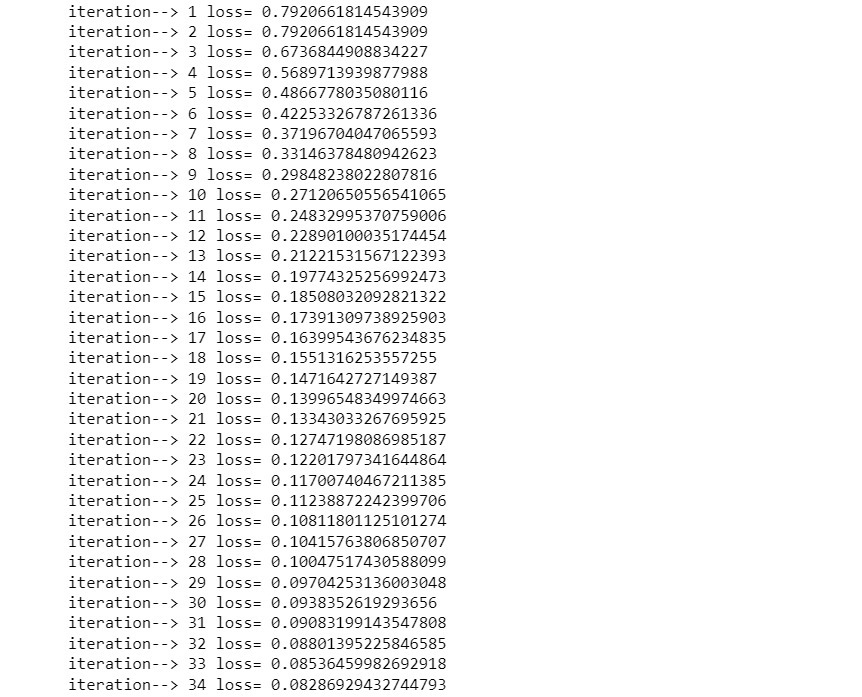

# miniKeras


A scaled-down version of Tensorflow with Keras like api build from scratch using python.
Capable of building a dense neural network and carrying out internal backpropagation. Apart from building, the model can be trained on a dataset of scalar values(not multi-dimensional arrays like tensors) to fit using optimizing algorithms like gradient descent.Supports various activation functions and loss functions.


### Installation

```bash
pip install miniKeras
```

### Example of a Variable:

Below is an example of a Variable(smallest unit of the network) objects in action for better understanding of the working:

```python

from miniKeras.unit import Variable

a = Variable(1,name='a')
b = Variable(2,name='b')
ab = a*b
ab.name='ab'
c = ab**2
c.name='c'
f = c.tanh()
f.name = 'f'
print(f.val)  #f.val = 0.999329299739067
f.backprop()  #backpropagation at work.
print(a.grad) #(gradient of f w.r.t a) df/da = 0.010727605464206924
print(b.grad) #(gradient of f w.r.t b) df/db = 0.005363802732103462

```

### Example of a network:

Below is an example of a neural network build and trained on small dataset:

```python
from miniKeras import network

l = network.Sequential(
    [
        network.layers.Dense(3, name='layer1'),
        network.layers.Dense(2, name='layer2'),
        network.layers.Dense(1, name='layer3'),
    ]
)
l.Compile()
x = [1,2]
y=[1]
l.fit(x,y, running_status=True) #running_status will show the running status of the loss in each iteration.
# loss can be seen to descent with time which also depends on the step_size(alpha)
```
Loss is decreasing with each iteration:


### Visualization

`Visualization.ipynb` is also added for visualization purposes which uses Graphviz to render images.
Below code represents a simple digraph of Variable object.

```python
from miniKeras.unit import Variable
a = Variable(1, name='a')
b = Variable(2, name='b')
ab=a*b
c = Variable(3, name='c')
d = ab+c
e = d.tanh()
draw_graph(e)
# Draws the simple graph of Variable object
```


### License

MIT
